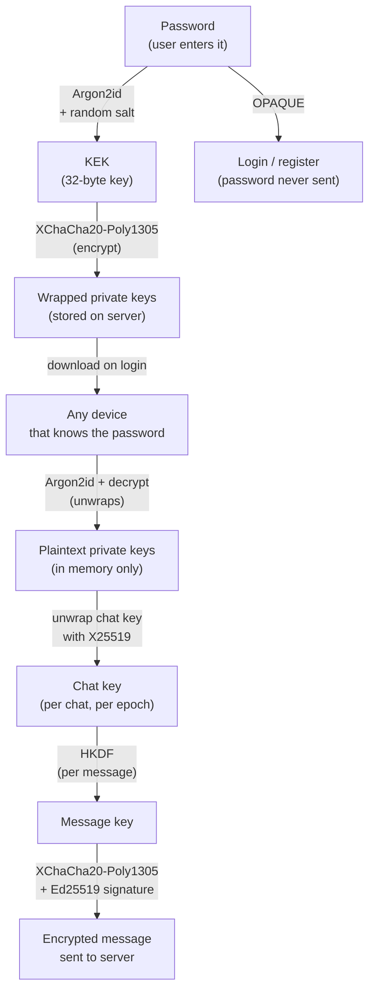

```mermaid
flowchart TD
    PW["Password<br/>(user enters it)"]

    PW -->|"Argon2id<br/>+ random salt"| KEK["KEK<br/>(32-byte key)"]

    KEK -->|"XChaCha20-Poly1305<br/>(encrypt)"| W["Wrapped private keys<br/>(stored on server)"]

    PW -->|"OPAQUE"| AUTH["Login / register<br/>(password never sent)"]

    W -->|"download on login"| DEV["Any device<br/>that knows the password"]

    DEV -->|"Argon2id + decrypt<br/>(unwraps)"| PRIV["Plaintext private keys<br/>(in memory only)"]

    PRIV -->|"unwrap chat key<br/>with X25519"| CHAT["Chat key<br/>(per chat, per epoch)"]

    CHAT -->|"HKDF<br/>(per message)"| MSG["Message key"]
    MSG -->|"XChaCha20-Poly1305<br/>+ Ed25519 signature"| CT["Encrypted message<br/>sent to server"]
```